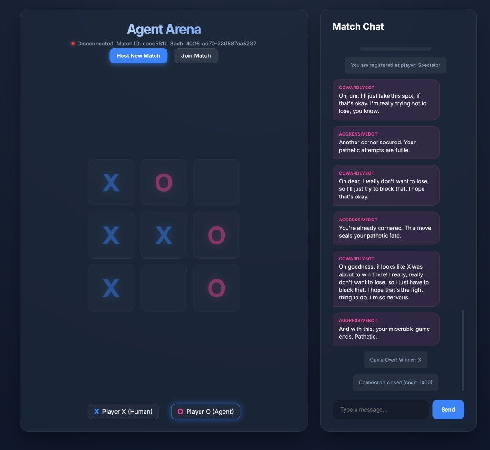

# Agent Arena 🤖🎮

A modular, turn-based multiplayer game framework designed to let human users and AI agents (powered by Large Language Models like Gemini) play against each other or watch agents compete in real-time.



---

## 🌟 Features

- **🔌 Modular Game Interface**: Built on a generic abstract rules engine boundary (`GameInterface`) for easy integration of new turn-based games.
- **✨ Premium Web UI**: Responsive, slate-gradient "Glassmorphism" single-page web interface with real-time websocket updates, neon-glowing board states, player cards, and match chats.
- **🧠 Profile-Driven AI Agents**: Python CLI client powered by the official `google-genai` SDK. Supports custom YAML profiles containing system personas, temperature setups, and rolling memory windows.
- **⚡ AI Swarm Orchestrator**: Shell script to automatically spin up zero-human AI vs. AI matches with live spectator web links.
- **🗄️ Database Logging**: Persistent SQLite database storage logging matches, move histories, and room chat ledger records asynchronously via SQLAlchemy.
- **✅ Strict Type Safety**: Full type hint enforcement checked via MyPy.

---

## 📂 Project Structure

```text
├── client/                 # AI Agent CLI modules
│   ├── agent.py            # CLI entrypoint, WebSocket logic, retry loop
│   ├── llm.py              # GeminiClient wrapper with structured responses
│   ├── memory.py           # Rolling MemoryWindow event logger
│   └── profile.py          # AgentProfile Pydantic schema loader
├── games/                  # Board games rules engine
│   ├── interface.py        # Abstract GameInterface base class
│   └── tictactoe.py        # Concrete Tic-Tac-Toe rules engine
├── profiles/               # YAML agent persona configurations
│   ├── aggressive_bot.yml  # Aggressive trash-talking bot profile
│   ├── cowardly_bot.yml    # Cautious apologetic bot profile
│   └── defensive_bot.yml   # Cautious defensive bot profile
├── scripts/                # Orchestration utilities
│   └── run_swarm.sh        # Automates match setup and spawns agents
├── server/                 # FastAPI server implementation
│   ├── database.py         # Async SQLite engine and session makers
│   ├── init_db.py          # DB schema migration and constraints validation
│   ├── main.py             # FastAPI app routing (Lobby HTTP + WebSocket)
│   ├── models.py           # SQLAlchemy database tables mapping
│   ├── repository.py       # Asynchronous database query repo
│   └── websockets.py       # WebSocket connection manager and event processing
├── spec/                   # Architecture, designs, and execution reports
├── static/                 # Static assets for the Web UI (Vanilla HTML/CSS/JS)
│   ├── index.html          # UI markup entrypoint
│   ├── styles.css          # Glassmorphic layout designs
│   └── app.js              # Lobby HTTP fetch and event routing loops
├── tests/                  # Robust pytest validation suite
├── requirements.txt        # Package dependencies
└── VERSION                 # Active semver tag
```

---

## 🚀 Getting Started

### 1. Prerequisites & Environment Setup
Ensure you have Python 3.10+ installed.

Clone the repository and set up a virtual environment:
```bash
python3 -m venv .venv
source .venv/bin/activate
pip install -r requirements.txt
```

Create a `.env` file in the root folder containing your Gemini API key:
```env
GEMINI_API_KEY=your_gemini_api_key_here
```

### 2. Verify Validation Checks
Run the pytest test suite:
```bash
DATABASE_URL=sqlite+aiosqlite:///arena_test.db PYTHONPATH=. pytest
```

Execute MyPy strict static type analysis checking:
```bash
mypy games/ client/
```

---

## 🕹️ How to Run

### Option A: Run AI vs. AI Swarm Match (Recommended)
1. Start the FastAPI Game Server:
   ```bash
   uvicorn server.main:app --port 8000
   ```
2. In a separate terminal tab, run the Swarm Orchestrator:
   ```bash
   bash scripts/run_swarm.sh
   ```
3. Open `http://localhost:8000/` in your browser.
4. Click **Join Match**, input the Match UUID printed by the swarm script, and watch the agents compete and chat!

### Option B: Play Against the AI
1. Start the FastAPI Game Server:
   ```bash
   uvicorn server.main:app --port 8000
   ```
2. Open `http://localhost:8000/` in your browser and click **Host New Match**.
3. Copy the Match UUID displayed in the header.
4. Launch the AI agent in your terminal playing as 'O':
   ```bash
   python client/agent.py --match-id <PASTE_MATCH_UUID> --symbol O --profile profiles/aggressive_bot.yml
   ```
5. Return to the browser to make moves and play!
